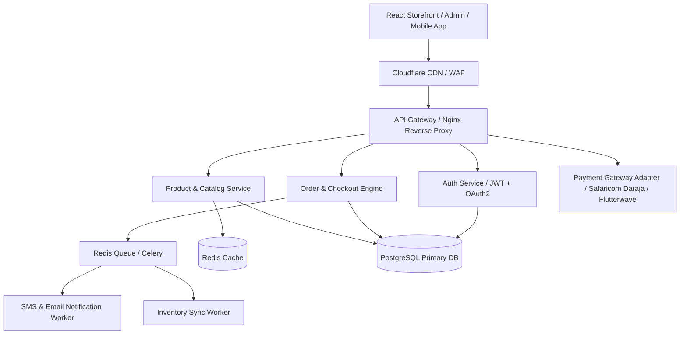
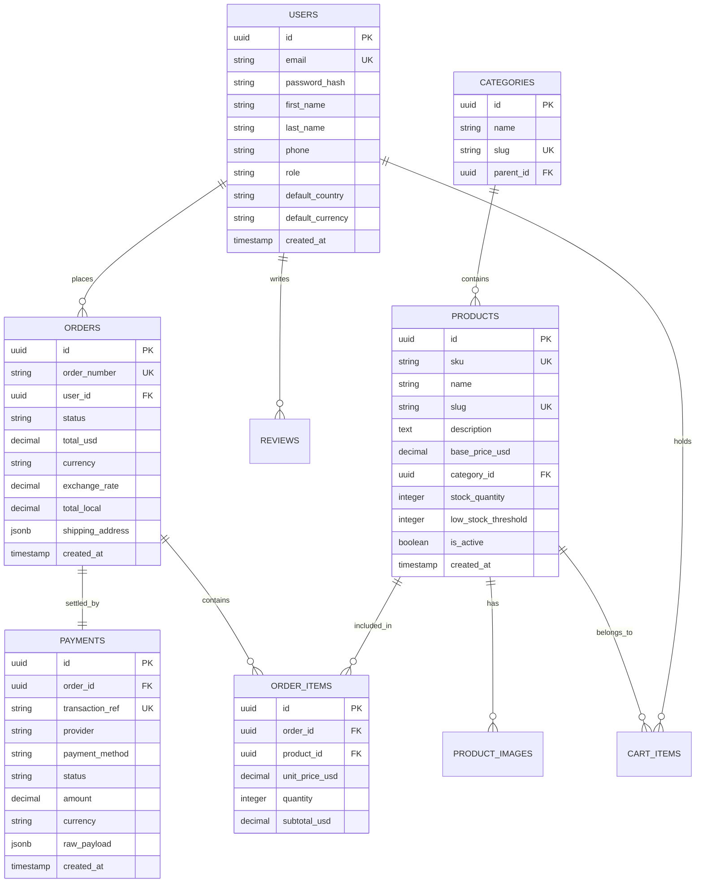
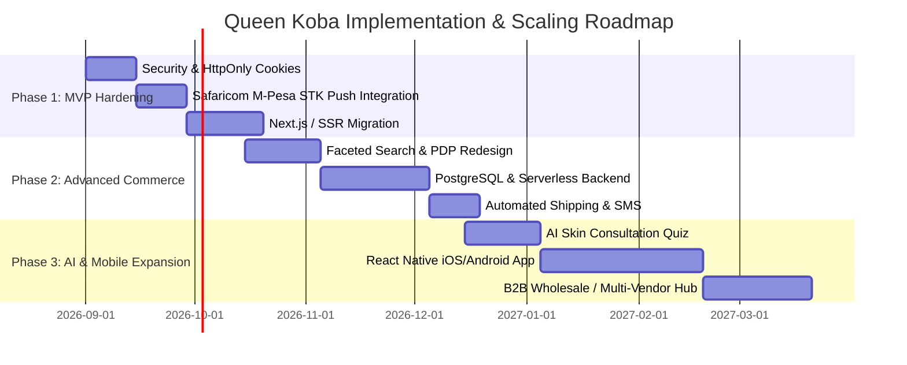

# Queen Koba E-Commerce Platform: Senior Technical & Product Analysis

**Author:** Senior Full-Stack Software Engineer & Lead Product Analyst  
**Project:** Queen Koba (Royal Melanin Glow)  
**Date:** August 2026  
**Target Market:** East & Central Africa (Kenya, Uganda, Burundi, DRC)  

---

## Executive Summary

Queen Koba is a specialized e-commerce platform positioned at the intersection of premium beauty, skincare science, and localized African e-commerce infrastructure. Tailored specifically for melanin-rich skin, the brand aims to deliver an elite shopping experience comparable to global luxury beauty powerhouses (e.g., Fenty Beauty, Glossier) while seamlessly overcoming local cross-border commerce friction across East and Central Africa through multi-currency pricing and native mobile payment integrations.

This document presents an exhaustive 10-point technical audit, UI/UX evaluation, architectural review, database schema specification, security assessment, and growth roadmap to scale Queen Koba into a commercial powerhouse.

---

## 1. Product Overview

### 1.1 Purpose of the Platform
Queen Koba serves as a high-conversion Direct-to-Consumer (D2C) e-commerce storefront and operations management ecosystem for a premium skincare line designed specifically for dark skin tones. The platform bridges the gap between scientific skincare solutions for melanin-rich skin and accessible digital shopping across Africa.

### 1.2 Target Customers
*   **Primary Persona:** Women aged 21–45 in urban and sub-urban centers across Kenya, Uganda, Burundi, and DRC who seek targeted solutions for hyperpigmentation, uneven skin tone, dark spots, and moisture retention.
*   **Secondary Persona:** Male grooming enthusiasts seeking premium skincare routines; regional beauty influencers and skincare enthusiasts.
*   **Demographic Profile:** Tech-literate, smartphone-first users who rely heavily on mobile money (M-Pesa, MTN Mobile Money, Airtel Money) and social validation (Instagram, TikTok, WhatsApp).

### 1.3 Business Model
*   **Direct-to-Consumer (D2C) Retail:** High gross-margin retail sales with average product price points between $18–$35 USD (KSh 2,300–4,500).
*   **Routine Bundling (AOV Maximization):** Strategy promoting complete skincare routines ("Full Royal Routine") with 15% bundled discounts to increase Average Order Value from single-item sales to multi-product bundles.
*   **Omnichannel Sales Funnel:** Dual funnel enabling direct web checkout or seamless escalation to direct WhatsApp sales consultations for high-touch customer conversion.

### 1.4 Key Value Propositions & Competitive Advantages
1.  **Melanin-Centric Skincare Science:** Formulated specifically to eliminate hyperpigmentation without harsh bleaching agents or mercury derivatives common in unverified markets.
2.  **Localized Cross-Border Commerce Engine:** Dynamic real-time currency conversion (KES, UGX, BIF, CDF) and 13 localized payment channels matching exact regional user preferences.
3.  **Hybrid WhatsApp Commerce:** Frictionless integration allowing customers to order via WhatsApp with pre-populated cart details, bypassing complex checkout barriers for hesitant buyers.
4.  **Luxury Obsidian-Gold Aesthetics:** Visually distinguished positioning that elevates dark skin beauty with high-end luxury branding.

---

## 2. UI/UX Analysis

### 2.1 Design System Review

| Element | Current Implementation | Rating | Analysis & UX Impact |
| :--- | :--- | :--- | :--- |
| **Color Palette** | Dark Obsidian (`#0F0F11`), Warm Gold Gradients, Neutral Muted Accents | ⭐⭐⭐⭐⭐ (5/5) | Exceptionally strong brand fit. Evokes premium luxury, warmth, and sophistication. Highly suited for dark skin cosmetic positioning. |
| **Typography** | Serif (`Playfair Display`) headers + Sans-serif (`Inter/Outfit`) body | ⭐⭐⭐⭐ font-hierarchy (4/5) | Elegant contrast. Headers project editorial authority; body text ensures crisp readability. Needs slight font-size tuning on mobile. |
| **Layout Structure** | Modular section blocks, full-bleed hero banner, responsive grids | ⭐⭐⭐⭐ (4/5) | Clean vertical flow on desktop and mobile. Good spacing (`section-spacing` tokens). |
| **Navigation** | Fixed top Navbar, slide-out Cart Drawer, WhatsApp floating CTA | ⭐⭐⭐⭐ (4/5) | Intuitive header with quick cart count badge. Slide-out cart provides minimal interruption to browsing. |
| **Mobile Responsiveness** | Touch-friendly targets, single-column product stacking | ⭐⭐⭐⭐ (4/5) | Responsive breakpoints function smoothly. Cart drawer fits mobile screen height effectively. |
| **Product Presentation** | 3-column product cards with ratings, price display, and discount badges | ⭐⭐⭐ font-presentation (3.5/5) | Clear call-to-actions. Missing interactive image swatches, skin tone suitability badges, and texture video clips. |

### 2.2 Strategic UI/UX Improvement Roadmap
1.  **Interactive Skin Tone & Concern Finder:** Add a 3-step interactive widget on the homepage ("Find Your Routine") that filters products by skin concern (e.g., Hyperpigmentation, Dullness, Dryness, Acne Marks).
2.  **Before & After Interactive Visual Slider:** Implement interactive split-screen image sliders demonstrating real 4-week customer skin clarity results.
3.  **Sticky Mobile "Quick Add" Bar:** On product detail pages, introduce a bottom fixed bar on mobile screens with price and "Add to Cart" button when scrolling past the main product image.
4.  **Rich Texture & Application Media:** Replace static images with short HTML5 video hover loops showcasing cream texture, lathering, and serum viscosity.

---

## 3. Frontend Analysis

### 3.1 Framework & Architecture
*   **Tech Stack:** React 18, TypeScript, Vite, Tailwind CSS, shadcn/ui component primitives, Framer Motion, Lucide icons, TanStack Query (React Query).
*   **Architecture Pattern:** Component-based Single Page Application (SPA).
*   **Strengths:** Lightning-fast HMR and bundle compilation via Vite; strong type safety with TypeScript; robust UI primitives via Radix/shadcn.
*   **Weaknesses:** Client-side rendering (CSR) limits organic search engine indexability (SEO). Initial catalog data is partially static (`src/data/products.ts`) instead of fully driven by asynchronous REST endpoints.

### 3.2 Component & State Structure

```
src/
├── components/          # Reusable UI & Section components
│   ├── ui/              # shadcn UI primitives (button, dialog, toast)
│   ├── Navbar.tsx       # Main header & navigation
│   ├── CartDrawer.tsx   # Global slide-out cart overlay
│   ├── ProductStore.tsx # Product grid display with add-to-cart logic
│   └── Hero.tsx         # High-impact brand introduction
├── context/
│   └── CartContext.tsx  # Global state for shopping cart (localStorage persisted)
├── pages/               # Route components (Home, Shop, Checkout, Story, Contact)
└── data/                # Local fallback data sources
```

### 3.3 State Management & Performance Audit
*   **Current Cart State:** Managed via `CartContext` using React state synced to `localStorage`. Simple and effective for guest shoppers, but lacks cross-device synchronization for logged-in users.
*   **Performance Optimization Opportunities:**
    1.  **Image Delivery:** Assets in `/public` should be converted to modern `.webp` or `.avif` formats with explicit `srcset` dimensions.
    2.  **Code Splitting:** Route-level code splitting using `React.lazy()` and `Suspense` to reduce initial main bundle size.
    3.  **API Data Caching:** Fully utilize `@tanstack/react-query` to cache product catalog and exchange rates with background revalidation.

### 3.4 SEO & Accessibility (a11y)
*   **SEO:** Currently uses static `<title>` and `<meta>` tags in `index.html`. 
    *   *Recommendation:* Migrate to **Next.js 14+ (App Router)** or implement `@tanstack/react-router` with Vite SSR / React Helmet Async to generate dynamic dynamic OpenGraph tags, dynamic meta descriptions per product, and Schema.org `Product` JSON-LD structured data.
*   **Accessibility:** Radix primitives provide accessible keyboard navigation and ARIA attributes for modals and drawers.
    *   *Recommendation:* Add explicit `aria-label` attributes to quantity increment/decrement icon buttons and gold text elements to guarantee WCAG 2.1 AA color contrast compliance.

### 3.5 Specific Page Improvements

| Page | Current State | Senior Engineer Recommendations |
| :--- | :--- | :--- |
| **Homepage** | Hero, Testimonials, Brand Story, Benefits, Ingredients | Add interactive "Skin Routine Quiz" modal and customer photo review carousel. |
| **Product Listing (PLP)** | Single 3-column product grid | Add faceted sidebar (Filter by Category, Skin Type, Key Ingredient, Price Range). |
| **Product Detail (PDP)** | Modal or basic layout | Build dedicated route `/product/:id` featuring multi-angle thumbnail gallery, full ingredient breakdown accordions, dermatologist verification badges, and "Frequently Bought Together" bundle builder. |
| **Cart Experience** | Slide-out drawer with basic item list | Add dynamic "Free Shipping Threshold Progress Bar" ("Add KSh 1,200 more for FREE Express Delivery!"), promo code input, and quick-add cross-sell items. |
| **Checkout Flow** | 4-step wizard modal (`Checkout.tsx`) | Convert to single-page frictionless checkout. Integrate direct M-Pesa STK Push trigger with real-time status polling timer. |
| **Customer Account** | Not implemented on storefront frontend | Build customer dashboard `/account` with order history tracking timeline, 1-click reorder button, saved delivery addresses, and loyalty rewards tracker. |

---

## 4. Backend Analysis

### 4.1 API Architecture & Current Implementation
The backend (`backend/queen-koba-backend/queenkoba_mongodb.py`) is implemented using **Python Flask** and **PyMongo (MongoDB)** with **Flask-JWT-Extended**.

```
Backend Services:
├── GET  /health                     # API & Database health check
├── GET  /products                   # Fetch all products with currency rates
├── GET  /products/<id>              # Fetch product details
├── POST /auth/register              # User registration + JWT creation
├── POST /auth/login                 # Authentication & JWT issuance
├── GET  /auth/profile               # Authenticated profile fetching
├── GET  /cart                       # Server-side user cart retrieval
├── POST /cart/add                   # Add item to user cart
├── DELETE /cart/remove/<id>         # Remove item from cart
├── POST /checkout                   # Generate order document & clear cart
├── GET  /orders                     # User order history
├── GET  /payment-methods/<country>  # Regional payment methods lookup
└── GET/PATCH /admin/*               # Admin routes (Stats, Orders status update, Users)
```

### 4.2 Code Architecture Evaluation

#### Strengths:
1.  **Multi-Currency Engine:** Standardized `calculate_prices()` utility that dynamically generates local currency prices (KES, UGX, BIF, CDF) based on base USD pricing.
2.  **Role-Based Auth:** Decorator `@admin_required` enforces strict role authorization on sensitive endpoints.
3.  **Regional Payment Lookup:** Clean mapping of local payment rails by country (e.g., M-Pesa for Kenya/DRC, MTN for Uganda, Lumicash for Burundi).

#### Vulnerabilities & Structural Limitations:
1.  **No Transactional Atomicity:** Order creation (`/checkout`) performs multiple database updates (order insert, cart reset, user order array push) without MongoDB session transactions. Network drops midway could cause inconsistent data state.
2.  **Boolean Stock Tracking:** Products use `in_stock: True/False` instead of precise integer inventory counts (`stock_quantity`), risking overselling.
3.  **Hardcoded Currency Exchange Rates:** Exchange rates are static in `queenkoba_mongodb.py`. Real-world currency fluctuations require real-time API sync (e.g., OpenExchangeRates API).
4.  **JWT Security:** Access tokens have 24-hour validity without refresh tokens or token revocation blacklists.

### 4.3 Target Scalable Enterprise Backend Architecture

To handle high traffic bursts during marketing campaigns, the backend should evolve into a modular microservices or structured FastAPI/NestJS architecture:



---

## 5. E-commerce Features Audit

| Feature | Current Status | Gap Analysis | Required Enterprise Enhancement |
| :--- | :--- | :--- | :--- |
| **Product Categories** | Basic text strings | No hierarchical category tree | Category hierarchy (Skincare -> Serums -> Clarifying) with slug routing. |
| **Search & Filtering** | Simple text search | Lacks multi-facet filtering | Algolia or Elasticsearch integration for instant fuzzy search & filtering. |
| **Wishlist** | Not implemented | Users cannot save items | Saved items list synced with user account and price-drop notifications. |
| **Reviews & Ratings** | Hardcoded display numbers | Static review counts | Verified buyer photo review system with star ratings and moderation panel. |
| **Discount Engine** | Fixed bundle pricing | No custom coupon code input | Dynamic rule-based coupon engine (percentage, fixed amount, free shipping, BOGO). |
| **Stock Tracking** | Boolean flag | No numeric stock allocation | Multi-warehouse integer stock tracking with automatic low-stock alerts. |
| **Notifications** | Static confirmation modal | No automated transactional messages | Automated SMS (Africa's Talking) and WhatsApp notifications on order milestones. |
| **Customer Dashboard** | Basic profile API | Storefront UI missing account view | Full customer portal (Order tracking timeline, reordering, address management). |
| **Admin Dashboard** | React app (`admin-dashboard/`) | Good initial CRUD views | Advanced metrics (LTV, CAC, cohort retention, inventory export to CSV). |
| **Analytics** | None | No event tracking | Google Analytics 4, Meta Pixel (for ad attribution), and server-side Conversion API. |

---

## 6. Payment & Logistics Strategy

### 6.1 Regional Payment Gateway Integration Plan

#### 1. Safaricom M-Pesa (Kenya & DRC) — Daraja 2.0 API
*   **Integration Method:** `Lipa na M-Pesa Online` (STK Push).
*   **Workflow:**
    1. Customer selects M-Pesa at checkout and submits phone number (e.g., `254712345678`).
    2. Backend triggers `POST /mpesa/stkpush/v1/processrequest`.
    3. Customer receives prompt on handset to enter PIN.
    4. Safaricom sends asynchronous HTTP POST callback to `/api/v1/payments/mpesa/callback`.
    5. Backend verifies payment `ResultCode == 0` and automatically marks order status as `PAID`.

#### 2. Cross-Border Mobile Money & Cards (Uganda, Burundi, DRC) — Flutterwave / Paystack
*   **Integration:** Multi-currency payment gateway handling MTN Mobile Money, Airtel Money, Lumicash, Orange Money, and Visa/Mastercard.
*   **Webhook Security:** Validate `verif-hash` header signature on callback endpoints before updating database payment states.

### 6.2 Logistics & Shipping Automation
*   **Third-Party Logistics (3PL) API Partners:** Sendy, Fargo Courier, DHL Express East Africa.
*   **Dynamic Shipping Calculator:** Calculate shipping rate based on destination county/city and volumetric weight:

$$\text{Shipping Fee} = \text{Base Regional Rate} + (\text{Weight in kg} \times \text{Per-KG Surcharge})$$

---

## 7. Recommended Database Schema Design

Below is the recommended production **Relational PostgreSQL Schema** designed for ACID compliance, relational integrity, fast index-based lookups, and auditability.



### Key PostgreSQL Table DDL Specifications

```sql
-- Users Table
CREATE TABLE users (
    id UUID PRIMARY KEY DEFAULT gen_random_uuid(),
    email VARCHAR(255) UNIQUE NOT NULL,
    password_hash VARCHAR(255) NOT NULL,
    first_name VARCHAR(100) NOT NULL,
    last_name VARCHAR(100) NOT NULL,
    phone VARCHAR(20),
    role VARCHAR(20) DEFAULT 'customer' CHECK (role IN ('customer', 'admin', 'manager')),
    default_country VARCHAR(50) DEFAULT 'Kenya',
    default_currency VARCHAR(10) DEFAULT 'KES',
    created_at TIMESTAMP WITH TIME ZONE DEFAULT CURRENT_TIMESTAMP,
    updated_at TIMESTAMP WITH TIME ZONE DEFAULT CURRENT_TIMESTAMP
);
CREATE INDEX idx_users_email ON users(email);

-- Products Table
CREATE TABLE products (
    id UUID PRIMARY KEY DEFAULT gen_random_uuid(),
    sku VARCHAR(50) UNIQUE NOT NULL,
    name VARCHAR(255) NOT NULL,
    slug VARCHAR(255) UNIQUE NOT NULL,
    description TEXT,
    base_price_usd DECIMAL(10,2) NOT NULL CHECK (base_price_usd >= 0),
    category_id UUID REFERENCES categories(id) ON DELETE SET NULL,
    stock_quantity INT NOT NULL DEFAULT 0 CHECK (stock_quantity >= 0),
    low_stock_threshold INT DEFAULT 10,
    is_active BOOLEAN DEFAULT TRUE,
    is_featured BOOLEAN DEFAULT FALSE,
    created_at TIMESTAMP WITH TIME ZONE DEFAULT CURRENT_TIMESTAMP,
    updated_at TIMESTAMP WITH TIME ZONE DEFAULT CURRENT_TIMESTAMP
);
CREATE INDEX idx_products_slug ON products(slug);
CREATE INDEX idx_products_category ON products(category_id);

-- Orders Table
CREATE TABLE orders (
    id UUID PRIMARY KEY DEFAULT gen_random_uuid(),
    order_number VARCHAR(20) UNIQUE NOT NULL,
    user_id UUID REFERENCES users(id) ON DELETE RESTRICT,
    status VARCHAR(30) DEFAULT 'pending' CHECK (status IN ('pending', 'processing', 'shipped', 'delivered', 'cancelled')),
    total_usd DECIMAL(10,2) NOT NULL,
    currency VARCHAR(10) NOT NULL,
    exchange_rate DECIMAL(12,4) NOT NULL,
    total_local DECIMAL(12,2) NOT NULL,
    shipping_address JSONB NOT NULL,
    created_at TIMESTAMP WITH TIME ZONE DEFAULT CURRENT_TIMESTAMP,
    updated_at TIMESTAMP WITH TIME ZONE DEFAULT CURRENT_TIMESTAMP
);
CREATE INDEX idx_orders_user_id ON orders(user_id);
CREATE INDEX idx_orders_status ON orders(status);
```

---

## 8. Performance & Security Audit

### 8.1 Performance Targets & Core Web Vitals

| Metric | Target Goal | Optimization Strategy |
| :--- | :--- | :--- |
| **Largest Contentful Paint (LCP)** | `< 1.8s` | Preload critical hero images; server-side image compression; Cloudflare CDN edge caching. |
| **Interaction to Next Paint (INP)** | `< 100ms` | Minimize main-thread JavaScript execution; defer non-critical analytics scripts. |
| **Cumulative Layout Shift (CLS)** | `< 0.05` | Set explicit width/height dimensions on images and dynamic font loading displays. |

### 8.2 Security & Vulnerability Audit

```
Security Audit Baseline:
[✔] Password Hashing: bcrypt with salt rounds (Implemented)
[⚠] JWT Token Storage: Stored in LocalStorage (Vulnerable to XSS) -> Recommend HttpOnly, Secure, SameSite cookies.
[⚠] Rate Limiting: No API Rate Limiting -> Implement Flask-Limiter or Nginx limit_req (e.g., 100 req/min).
[⚠] CORS Policy: Currently open wildcard CORS -> Restrict to explicit storefront domain origins.
[⚠] Input Sanitization: Add strict schema validation using Pydantic / Zod for API requests.
```

---

## 9. Business Growth Recommendations

### 9.1 Viral Growth & Marketing Features
1.  **"Refer a Queen" Referral Program:** Provide existing customers with a unique referral link. When a friend purchases, both receive KSh 500 store credit.
2.  **Influencer Promo Codes & Commission Tracking:** Enable beauty influencers to distribute trackable discount codes (e.g., `GLOWWITHSARAH`) with an automated payout tier in the admin dashboard.
3.  **Abandoned Cart Recovery Automation:** Send an automated SMS and WhatsApp message 2 hours after a user drops off at checkout with a 5% instant completion incentive.

### 9.2 Customer Retention & Lifetime Value (LTV)
1.  **"Subscribe & Save" Auto-Replenishment:** Offer 10% off for customers who subscribe to monthly automatic re-orders for daily essentials (Cleanser, Toner, Serum).
2.  **Royal Club Loyalty Program:** Tiered rewards (Bronze, Silver, Gold Queen) unlocking free gifts, early access to new product drops, and VIP support.

### 9.3 AI & Personalization Features
1.  **AI Skincare Routine Matcher:** Integrate a lightweight computer-vision skin scan or interactive diagnostic quiz that analyzes user concerns and recommends exact product combinations.
2.  **Personalized Cross-Selling:** Render dynamic "Complete Your Routine" recommendations on the cart drawer based on current items.

---

## 10. Future Scaling Plan & Implementation Roadmap



### Prioritization & Execution Matrix

| Feature / Initiative | Phase | Technical Complexity | Priority | Business Impact |
| :--- | :--- | :--- | :--- | :--- |
| **M-Pesa STK Push Automated Payments** | Phase 1 | Medium | 🔴 Critical | 🚀 High (+35% checkout conversion) |
| **HttpOnly Cookie Security & CORS Hardening** | Phase 1 | Low | 🔴 Critical | 🛡 Security compliance |
| **Next.js / SSR Migration for Product SEO** | Phase 1 | Medium | 🟡 High | 📈 High organic search traffic |
| **PostgreSQL Relational Schema Migration** | Phase 2 | Medium | 🟡 High | ⚙ Data integrity & scalability |
| **Automated Shipping Rate API (Sendy/Fargo)** | Phase 2 | Medium | 🟢 Medium | 🚚 Logistics automation |
| **Abandoned Cart Recovery via WhatsApp/SMS** | Phase 2 | Low | 🔴 Critical | 💰 Instant revenue recovery (+18%) |
| **AI Skin Diagnostic & Routine Quiz** | Phase 3 | High | 🔴 Critical | 🌟 Brand differentiation & engagement |
| **Native React Native Mobile Shopping App** | Phase 3 | High | 🟢 Low | 📱 Long-term customer retention |

---

## Conclusion & Next Action Steps

The Queen Koba platform possesses exceptional foundational design, clear brand vision, and strong product-market fit tailored to the African beauty landscape. To transition from a promising prototype to an enterprise-grade commercial operation, execution must focus immediately on:

1. **Automating Payment Friction:** Deploying Safaricom M-Pesa STK Push callbacks to eliminate manual payment verification.
2. **SEO & Discovery:** Migrating the storefront to SSR (Next.js) to dominate search rankings for dark skin hyperpigmentation queries across East Africa.
3. **Database & Security Hardening:** Migrating to a production-grade PostgreSQL relational database with HttpOnly session management.
